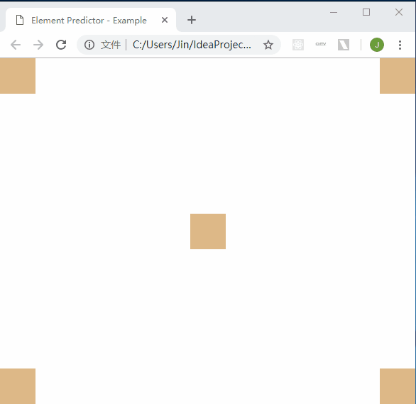

element-predictor
==============
[](https://www.npmjs.com/package/@jinwangchina/element-predictor)
[](https://www.npmjs.com/package/@jinwangchina/element-predictor)
[](https://www.npmjs.com/package/@jinwangchina/element-predictor)
[](https://www.npmjs.com/package/@jinwangchina/element-predictor)
[](https://www.npmjs.com/package/@jinwangchina/element-predictor)

Predict which element (DOM) the user wants to interact with so that your web app can react faster!

## Installation
```
npm install --save @jinwangchina/element-predictor
```

## Usage
```js
import ep from "@jinwangchina/element-predictor";

// the element selectors to predict
let elementSelectors = [ "#topLeft", "#topRight", "#center", "#bottomLeft", "#bottomRight" ];

// setup
ep.setup( {
    elementSelectors,
    handler: result => {
        if ( result ) {
            console.log( result.selector );  // the predicted element selector
            console.log( result.element );   // the predicted element object
            console.log( result.distance );  // the distance from cursor to the predicted element
        } else {
            console.log( "nothing predicted" );
        }
    }
} );

// start predicting
ep.start();

// stop predicting
ep.stop();

// destroy the setup
ep.destroy();
```

## Example
Check out "example" directory for the source code.  



## License
Apache-2.0
